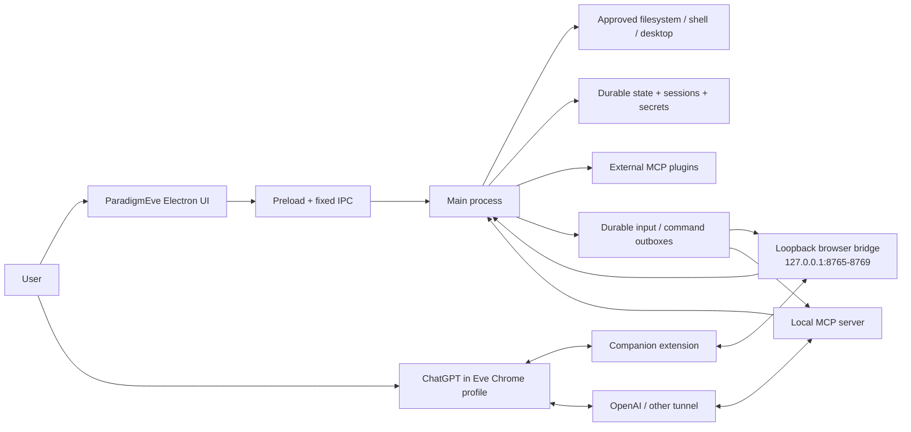

# 01 — System map

Back to [vault index](README.md).

ParadigmEve is an Electron desktop application that makes a ChatGPT conversation able to do durable local work. ChatGPT still owns model execution; ParadigmEve owns local tools, session continuity, browser coordination, persistence and recovery.

## The system in one diagram



There are two intentionally separate network paths:

1. **MCP path** — ChatGPT calls tools through the public tunnel into the local MCP server. This path deliberately does **not** trust a browser origin.
2. **Companion bridge path** — the Chrome extension talks to a loopback-only HTTP bridge using an encrypted pairing token and `chrome-extension://` origin checks. It reports browser observations and picks up browser work.

They converge in the main process, but neither is a substitute for the other. MCP proves a tool request; the Companion proves what exact ChatGPT document/tab is doing.

The browser/local boundary stays one-way in authority. Chrome and the Companion operate browser
state; Electron's main process operates local filesystem paths, permissions and app-owned resources.
Local paths stay in Eve. If a browser feature needs bytes, the main process may snapshot them into a
purpose-specific store and expose an opaque id plus bounded bytes after that exact browser operation
proves ownership. The bridge is never a generic local file-read API. App-owned mirrors such as the
stable Companion folder and the managed Vault Markdown mirror are materialization details, not
ambient Chrome filesystem access.

## The five identities to keep separate

Most of the architecture exists to stop these identities from being conflated:

| Identity | What it means | Durable? | Typical authority |
| --- | --- | ---: | --- |
| **Local session** | The continuous unit of work, recording, project and handoffs. | Yes | `session/store.ts` |
| **ChatGPT conversation** | One provider frontend (`/c/<id>`), replaceable after Compact & Resume. | Lineage retained | Companion + session metadata |
| **Turn** | One exact user-message generation / response episode. | Yes in session history | recorded turn events |
| **MCP request / call** | One tool invocation and its correlated caller evidence. | Recorded | MCP call context + recorder |
| **Worker run incarnation** | One configured-agent-owned worker-garden execution epoch. | Yes | `agents.ts` swarm snapshot |

The durable **session** is the important continuity identity. Compact & Resume changes the provider conversation from A to B without creating a new local session.

## Main-process ownership map

| Concern | Primary owner |
| --- | --- |
| App boot/shutdown, process lifetime, recovery ordering | `src/main/index.ts` |
| Local MCP server + tunnels | `src/main/connection.ts`, `src/main/mcp/server.ts` |
| Model-facing tool execution / caller fencing | `src/main/mcp/kernel.ts` + tool registrars |
| Companion loopback bridge + browser repair | `src/main/bridge.ts` |
| Durable session history | `src/main/session/store.ts`, `recorder.ts` |
| Durable user/internal input outbox | `src/main/session/input.ts` |
| Purpose-bound browser resources | `src/main/browser-resource.ts` + owning feature |
| Compact & Resume transaction | `src/main/session/continuation.ts` |
| Worker broker | `src/main/agents.ts` |
| Pins / Threads / Quilts | `src/main/pins.ts` |
| Pins context selection / fresh-chat injection | `src/shared/pins-context.ts`, `src/main/pins-context.ts` |
| First-class Plans | `src/main/plans.ts` |
| Plugin runtime | `src/main/plugins/manager.ts` |
| ChatGPT connector-schema refresh | `src/main/plugin-refresh.ts` |
| Config / permissions | `src/main/config.ts` |
| Encrypted credentials / pairing | `src/main/secrets.ts` |
| Approved-path sandbox | `src/main/sandbox.ts` |
| Per-chat learned cwd | `src/main/workspace.ts` |
| Expenses template/project binding | `src/main/expenses-project.ts`, `src/main/projects.ts` |
| Expenses canonical structured records | `src/main/expenses-ledger.ts`, `src/shared/expenses.ts` |
| Private local updater | `src/main/update.ts` |

## Renderer architecture

The renderer is intentionally untrusted relative to the main process:

- no Node.js;
- no direct filesystem access;
- no network authority;
- only the fixed `window.api` preload surface;
- main-process IPC handlers validate input with Zod;
- secrets can be set/cleared but never read back into the renderer.

The workspace has four peer destinations:

```text
View / Chat  <---->  Pins  <---->  Plans  <---->  Schedule
      \__________________________________________/
                    same session sidebar
```

All user-facing text goes through one localization layer (`src/renderer/i18n.ts` with the English-keyed
catalogs in `src/renderer/locales/`); the main process only hands it English source text or templates with
the agent's name as `{0}`. See [16 — Languages, localization and aliases](16-languages-localization-and-aliases.md).

Pins, Plans and Schedule are not separate projects. The conversation list remains visible so the user
can move between live chat, harvested knowledge, live work and schedule/routine state without hunting
for which chat owns an item. Schedule remains a first-class durable workspace rather than a Thread
activation; its `#myweek`, `#routines` and `#schedule` shortcuts are context only.

## Important authority patterns

### Durable before side effect

Where a retry could duplicate work, the intended pattern is:

```text
derive exact owner -> persist obligation/claim -> perform external/browser side effect -> record receipt
```

Examples: worker spawn/revival, browser input, restart recovery, chat review heartbeat, plugin refresh click, Compact & Resume send checkpoints.

### Exact identity before mutation

If ParadigmEve cannot prove the exact conversation/session/turn that owns an action, it should refuse or wait. Titles, timestamps, sidebar position and similar text are discovery clues, not authority.

### Browser ACK is not semantic completion

A transport can prove “ChatGPT accepted the message” without proving “the requested work is complete.” This distinction is explicit in the session input outbox, heartbeat receipts and worker lifecycle.

### Projections are rebuildable

Renderer state, in-memory indexes, browser presence TTLs, command offers and derived Plan views are projections. Durable JSON/session records or exact live evidence remain authority.

### Template projects separate intake, evidence, records and interpretation

An inbox-shaped template can reuse one familiar conversation while the linked local project owns the
canonical structured state. Expenses is the current dogfood example: `data/ledger.json` is the record
authority; chat and the linked `%expenses` Thread provide continuity and useful context. `#quilt`
is broader thematic/context scope and cannot silently choose that project. Raw receipts are optional,
user-controlled evidence rather than the default long-term data model. See the
[Expenses specification](../product/expenses.md) and generic [Feature Spec Template](../product/feature-spec-template.md).

Derived analysis is a different layer from observation. A template may fetch dated external context
only when it helps answer the question at hand; preserve enough source/date/geography/unit/method and
uncertainty to reproduce the comparison, label interpretation separately, and never mutate or rebase
the original project records to fit an index or benchmark.

## Startup sequence at a glance

The primary process roughly does this:

1. acquire single-instance lock;
2. initialize log, config, secrets, session and durable stores;
3. mark this recovery process lifetime;
4. restore config and plugins;
5. restore Goal state, request correlations and blocked chats;
6. wire + restore retired workers / swarm;
7. restore Compact & Resume continuations;
8. install renderer CSP/permission denial and IPC;
9. prepare restart-recovery input if this launch is recovery-authorized;
10. show/focus window and tray;
11. start Companion bridge when required;
12. start session retention and 22-minute review heartbeat;
13. connect MCP/tunnel if configured/forced;
14. run one-shot Companion/browser recovery when installer/update asked for it;
15. start private-local update checks.

See [Runtime, browser and recovery](02-runtime-browser-recovery.md) for the exact recovery implications.
