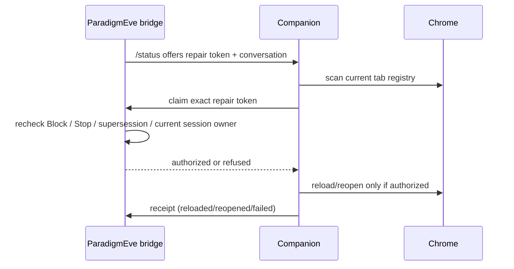

# 02 — Runtime, browser and recovery

Back to [vault index](README.md).

This subsystem is where “the app is running” is deliberately separated from “Chrome exists”, “the Companion is paired”, “a current ChatGPT document checked in”, and “this exact chat may be reloaded.”

## Process lifetime

`src/main/index.ts` owns the Electron lifetime.

- Only the process holding Electron's single-instance lock may initialize shared state.
- A second process can signal one-shot flags such as `--connect-on-start` or `--recover-companion-browser` to the primary.
- Shutdown is terminal: startup continuations are fenced so they cannot recreate a window or reconnect after quit has begun.
- Clean shutdown flushes durable work before recovery crash evidence is cleared.

## Dedicated Eve Browser

ParadigmEve uses a dedicated Chrome profile under its user-data area. This is the app-owned ChatGPT/Companion surface, distinct from the user's ordinary Chrome profile.

Why it exists:

- pairing and cookies are stable for Eve;
- browser recovery can target an exact native window identity;
- setup/provider pages do not accidentally open in another signed-in profile;
- app-owned recovery does not need a debugging port or Playwright attachment.

`src/main/setup-assistant.ts` owns profile launching and the setup/recovery browser helpers.

## Companion bridge

`src/main/bridge.ts` hosts a separate local HTTP server on `127.0.0.1`, normally one of ports **8765–8769**.

Security properties:

- only loopback;
- protected routes require a bearer token stored via `secrets.ts`;
- browser requests must come from a `chrome-extension://` origin;
- request bodies and request rate are bounded;
- the bridge transports observations and browser commands, not arbitrary filesystem/process access.

Pairing state and live presence are different facts:

- **paired** = an encrypted bridge token exists and has not been explicitly revoked;
- **present** = this app process has heard authenticated Companion traffic recently;
- **chatTabOpen** = the Companion's recent exact Chrome tab census says at least one ChatGPT tab exists;
- **recovery ready** = a current-version ChatGPT document registered with this app process and authenticated presence is fresh.

Persisted pairing from yesterday cannot satisfy post-install recovery readiness by itself.

## Browser repair authority

The current 2.3.3 source line uses **bridge protocol 15**.
Model discovery excludes command-marked handover and worker tabs. The page also refuses discovery
while it has a command marker, active command attempt or command journal gate, so opening the model
picker cannot replace the composer owned by that command. Background-window reconciliation leaves
pinned tabs in the user's chosen window.

If App Stop targets an exact turn still open locally after ChatGPT is idle and has no native Stop
control, the Companion records that turn as user-stopped and closes it through the observation path.
It does not require a native button that no longer exists.

Browser repair includes a final
`/browser-repair/claim` fence immediately before Chrome mutation. The flow is:



This closes the race where a repair could be valid when `/status` was read but invalid by the time the extension finished scanning tabs.

## Browser recovery is evidence-driven

Repairs can be queued for distinct reasons such as silence, assistant error, missing attribution,
compaction pickup, Goal pickup or worker/owner identity recovery. They share one per-conversation
repair owner so two watchdogs do not independently reload the same chat.

Important rules:

- A blocked or superseded chat loses repair authority.
- A Stop can revoke a queued repair before mutation.
- Silence is measured from durable activity evidence, not from browser visibility.
- A browser lifecycle event does not erase the semantic fact that a turn is still owed.
- A confirmed repair gets a cooldown / observation window; repeated reloads are bounded.
- A background tab can be raised when required because Chromium throttling can otherwise freeze long recovery work.

- An **unattributed-activity** repair first asks the page whether ChatGPT is streaming
  (`clf-page-status` → `streaming`). A streaming page is alive: the repair stands down, reports the handout
  as not done, and the next pass decides. Reloading mid-stream ends the reply ("Resume stream
  unavailable" / "could not be loaded"). Silence and assistant-error recovery still reload, because they
  exist for pages that look busy and are not.

Known broad silence windows in current code: ordinary work uses the standard two-minute silence concept; known Pro work gets a longer window. Exact constants and special Goal/compaction schedules live in `bridge.ts` and should be read before changing recovery timing.

## Page evidence on ChatGPT's current renderer and stream

ChatGPT is not an API; these shapes were measured live (2026-09-26) and are read only by the
Companion's page files. When ChatGPT changes them, probe the live page before changing code.

### Assistant replies (`extension/fiber.js`)

The page renders one `[data-turn-key]` element per exchange. React no longer passes message objects
(`id` + `author.role` + `content.parts`) through props. Each reply unit renders a **render item**,
`props.item = { type: 'assistant-message', messageId, latestMessageId, sourceMessageIds, content,
phase, completed, turnExchangeId }`, and a context provider below it carries `props.value =
{ messageId, isStreaming, conversationId, turnId }`.

`exchangeMessagesOf` still prefers real message objects when a page provides them, then adapts render
items (`renderItemMessage`) into the same model shape so all downstream identity/finality rules apply:

- identity is the provider `messageId`, and `latestMessageId` plus every `sourceMessageIds` entry must
  agree with it; an item built from several messages is not guessed at;
- a context naming another conversation, an unknown `phase`, or empty `content` drops the item;
- the reply is final only when `phase: 'final_answer'`, `completed: true` **and** its context says
  `isStreaming: false`; anything less is recorded as streaming;
- a final that was already settled before the current generation began cannot close a later turn if
  ChatGPT briefly remounts that previous answer around Send; turn ownership also checks whether the
  assistant section belongs below the current user question before accepting it as this turn's final;
- rendered HTML is joined by the exact `data-chatgpt-selection-message-id` holder, never by text.

Render items carry no creation time. A reply backfilled from an older exchange is therefore timed when
it is recorded, not when ChatGPT wrote it.

### Tool-call attribution (`extension/usage.js` → `content.js` → bridge)

A connector call reaches the app with ChatGPT's request id, which is one id for the whole assistant
turn. The page learns that id from the `/backend-api/f/conversation` event stream:

1. the response opens with an event naming `conversation_id`; the following `input_message` event
   carries `input_message.metadata.request_id` with no conversation. `usage.js` joins them **within
   one response only**; an event naming a second conversation retires the join;
2. `content.js` parks an id that arrives before its chat has a `/c/` route, and keeps it across the
   move into exactly the chat it names;
3. the page posts the sighting to `/correlations`. ChatGPT announces the id when the turn starts,
   usually before the first tool call, so the app often answers `pending`. The bridge keeps pending
   sightings (bounded count, 15 minutes) and completes the join the moment local MCP admits a call
   carrying that exact id (`onInboundToolRequest` → `completeEarlySighting`). Admission is still
   required and an existing correlation is never overwritten;
4. the page also remembers its sightings (bounded, 15 minutes). When the app asks it to reconnect
   recorder evidence (`clf-recorder-reconnect`), it re-offers them. This recovers a turn that spans an
   app restart, since the restarted app never received the turn's one-time announcement.

A healthy call logs `bridge: request <id> attributed to <conversation> from its earlier stream
sighting` and has a small `identity_ms`; a missing join waits `identity_ms=20000` and is filed under
Unattributed activity.

Known limit: `usage.js` runs only when a ChatGPT document loads, and a Companion reload re-injects
`chatgpt-dom.js`, `fiber.js` and `content.js` but not `usage.js`. A tab that stays open across an
update keeps the previous stream reader until that tab is next reloaded while idle.

## Restart recovery

`src/main/session/recovery-memory.ts` implements the app restart contract.

Recovery is authorized only by one of these conditions:

- previous app lifetime was unclean;
- background/login recovery launch;
- explicit Companion recovery launch;
- update/reinstall launch.

An ordinary foreground open is not enough.

The app finds a recovery candidate narrowly: an ordinary current conversation with an open durable turn that has **exact request-id-attributed local tool work after that turn began**. It will not choose “the latest-looking chat.”

Before touching the browser it enqueues a deterministic durable recovery input for the exact session/conversation/turn. The id is derived from those identities, making repeated restarts idempotent.

That wake is bound to the open turn it recovers and retires as "the conversation moved on" as soon as a
newer turn boundary appears. App-internal automation must therefore let it land first: automatic
Compact & Resume is not filed for a session that still owes its restart wake (`restartRecoveryPending`),
because posting the app's own handoff would open that newer turn itself. A user message still moves the
conversation on and retires the wake.

That ordering applies before a new automatic handover starts. If Compact & Resume is already replacing
the source conversation, the old chat is fenced from receiving new queued input. The restart wake stays
durable and follows the same session to the successor after the continuation commits, instead of being
typed into the chat that is being replaced.

`RECOVERY.md` in userData is informational policy for the agent. It is not delivery authority; the durable outbox is.

## Companion refresh during reinstall/update recovery

Replacing the packaged extension files is not enough when the dedicated Chrome profile is already
running: that profile can still have the previous MV3 generation loaded. Reinstall/update recovery
therefore materializes the current Companion into ParadigmEve's stable unpacked-extension folder and
then refreshes the dedicated profile through Chrome's own restart/session restore path.

- If the dedicated profile is already open, ParadigmEve restarts that exact profile through
  `chrome://restart/`, allowing Chrome to reload the current Companion and restore its durable session.
- If the profile is closed, ParadigmEve launches it with **restore last session**; no extra restart is
  needed.
- If Chrome presents **Restore pages?** after an unclean browser/system shutdown, recovery invokes the
  native **Restore** action before opening replacement tabs.
- Restored human tabs are preserved. Exact Eve/worker conversations are reused only when their identity
  is proven.
- `chrome://extensions/` is setup/maintenance, not an automatic recovery destination.

### Companion build identity

Every debug build of one version reports the same `version` and bridge protocol, and Chrome keeps
running the unpacked code it loaded until the extension reloads. Two rules keep the running Companion
equal to the installed one:

- **Materialize before any browser launch.** At startup the app refreshes the stable Companion folder
  before the bridge answers `/hello` and before any restore/recovery path opens the Companion profile.
- **Name the build.** Each materialized manifest is stamped with `version_name = "<version> build
  <12-hex fingerprint>"`, and `/hello` and `/status` report that `companionBuild`. A Companion whose
  *loaded* manifest names a different build calls `chrome.runtime.reload()` once per named build (never
  a loop), but only from a maintenance pass in which `/status` says `companionBusy: false` (no tool call
  or MCP request running), no bridge command is in flight, and every ChatGPT page answers
  `clf-recorder-ping` with `busy: false`; a page that answers without `busy` runs older code and counts as
  busy. `runtime.onInstalled` then re-injects the current page code into already-open ChatGPT tabs.
  Unstamped development folders are never second-guessed. Companions up to 2.2.9 still reload as soon as
  `/hello` names another build, which is why `/hello` keeps the field (ported from chat-on-steroids 2.1.17).

## 22-minute semantic review heartbeat

`src/main/chat-review-heartbeat.ts` is a separate kind of recovery: it recovers **user intent that received prose but not the requested local execution**, and it prevents older durable Plan commitments from disappearing merely because they aged out of the recent-chat window.

Every 22 minutes, one exact non-worker/non-helper connector-proven conversation can receive one durable epoch with two obligations:

- review the recent request window, using local session history first and signed-in ChatGPT web history when relevant cross-device chats are missing locally; and
- review a rotating batch of at most four durable Live Plans, following each exact Plan → Source before classifying or acting.

Each selected Plan requires direct `chat_review_plan` acknowledgement. Evidence-backed checklist reconciliation may mark only exact open items done; the Plans owner atomically fences revision plus full source provenance. Human Plans are never auto-archived. Partial acknowledgements survive restart/owner transfer, and retries omit already-acknowledged Plan snapshots so bounded unattended work is not duplicated.

The Plan snapshot is display-bounded against the real 96k browser-message cap by shortening only item display text; ids, statuses, revision and provenance stay exact. Final completion revalidates all live Plan targets under the Plans-owner validation fence while the heartbeat receipt is committed.

Completion requires explicit `chat_review_complete({key})`. Browser send/final text is not enough.

Pending debt survives:

- restart;
- exact Compact & Resume rebind from conversation A to B;
- canonical `turn_end: stalled` transfer to another proven ordinary coordinator.

The fixed Plan batch and partial acknowledgements move with that same epoch/key. A selected Plan that changes revision or provenance is re-reviewed; a later authoritative archive is accepted; malformed or missing Plan state fails closed.

See the detailed design in [`docs/chat-review-heartbeat-implementation.md`](../chat-review-heartbeat-implementation.md).

## Reinstall controller contract

`scripts/windows-self-reinstall.ps1` is deliberately external to the app process. **Do not pre-close Eve or Chrome for a normal upgrade.** The controller starts the assisted installer and lets the installer request that the running Eve instance close. That is the path designed to survive app shutdown and continue driving the install.

After install, the controller starts/signals Eve with:

```text
--connect-on-start --recover-companion-browser
```

This is intentionally a foreground recovery launch. It uses the normal initial-window path so Eve is visible after the upgrade instead of leaving the recovered app tray-only.

Chrome's durable session is authoritative for restart recovery. An already-open dedicated profile is
restarted through `chrome://restart/`; a closed profile is launched with Chromium's **restore last
session** request. If Chrome reports **Restore pages? Chrome didn't shut down correctly.**, Eve invokes
native **Restore** before considering replacement tabs. The restored session can include the human's
ordinary tabs as well as Eve/worker ChatGPT tabs, so recovery preserves the whole session and lets
exact-conversation discovery reuse those restored documents instead of synthesizing replacements.

### Current readiness fence

`windows-self-reinstall.ps1::Test-RecoveryReady` requires a current `/recovery` document with
product `paradigmeve`, bridge `15`, and `ready=true`. A successful installer exit or an Electron
process alone is not recovery readiness; a current-generation Companion ChatGPT document must have
checked in to this app process.
