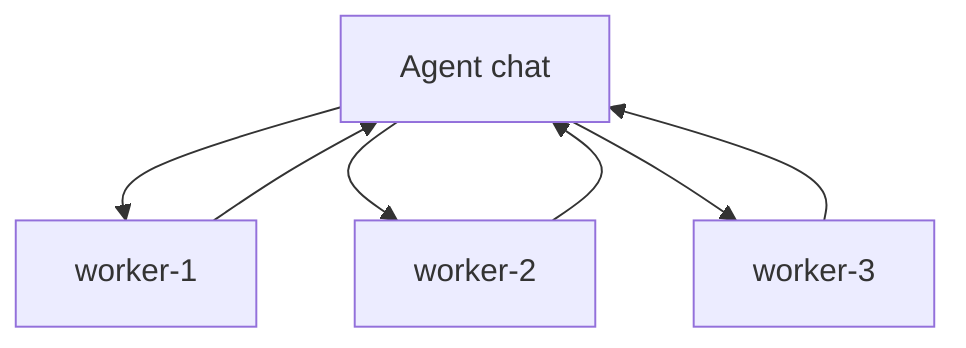

# 05 — Workers and multi-agent

Back to [vault index](README.md).

`src/main/agents.ts` is the durable broker for **the configured agent's worker garden**. The persisted
broker owner role is still named `prime` internally for compatibility; it is not a second persona
above Eve, Eva, or whatever name `mcp.connectorName` gives this installation's agent.

## Topology



Workers cannot message other workers. The installation's agent can steer her workers, and workers
report their results back to her.

Friendly ids like `worker-2` are local to one run and are never global ownership keys.

## The configured agent is the human-facing owner

The worker broker is the persistent harness. The model/runtime used for the owning agent and the
model/runtime used for workers are selectable execution backends. They do not create another identity
above the configured agent name.

Conceptually:

```text
                  ParadigmEve
             orchestration + durability
                       |
              +--------+--------+
              |                 |
          Agent owner         Workers
              |                 |
        selected backend   selected backend
```

This separation is why a future configuration can mix a managed orchestrator with local or cheaper
workers without rebuilding the broker around a new identity model. Selection never means fallback:
an unavailable or unimplemented backend is a visible user/setup boundary.

In the current source line, GPT Chat is the end-to-end agent executor for the owning agent (Prime).
Since 2.3.5, Ollama is a supported **worker** driver: Settings > Agent execution takes an
OpenAI-compatible endpoint (HTTP only on loopback, HTTPS elsewhere) and an exact model id such as
`gemma4:cloud`. Spawned Ollama workers never open a ChatGPT tab; the app runs a bounded model/tool
loop with a broker-issued run/worker principal and the same live Core permissions. Each Ollama
worker is one-shot: it finishes (or fails) as a terminal row, cannot be revived, and a restart
fails any in-flight Ollama worker visibly instead of reconstructing its transcript. Ollama cannot
be the agent driver. GPT Work and custom remain unavailable agent executors.

The desktop chat can also send a single turn to Ollama (2.3.5). The chat owns its history, not the
provider: every turn, whichever provider answered, lands in the same session archive with a
`provider` tag on Ollama messages. Ollama turns read the whole archive; a ChatGPT turn after Ollama
turns receives a catch-up of exactly the turns it did not see. A switch that exposes earlier turns
to a different provider needs the user's confirmation, and a chat marked Local only refuses ChatGPT
and Ollama Cloud (`:cloud` models or HTTPS endpoints). If you are asked about an earlier part of a
chat that another model answered, read the session history rather than assuming you never saw it. `/models` or
`/chat/completions` reachability alone is never agent-execution readiness proof.

## Run and worker identities

One conversation belonging to the installation's agent owns a worker garden. An active broker run has
a fresh run/incarnation UUID. Browser command/revival transactions carry that exact run identity so a
`worker-1` from another run cannot be confused with this one.

## Worker states

Conceptually:

```text
invited -> active -> sleeping
           |  \-> detached
           |       \-> sleeping/failed
           \-> finished/failed

sleeping --agent message--> waking -> active
```

Important distinctions:

- **sleeping** = reusable and does not consume an active slot;
- **finished/failed** = terminal worker history;
- **detached** = browser tab disappeared, but the server-side turn may still exist, so the slot remains occupied;
- **waking** = revival is in progress and owns a slot.

By default config starts with 2 workers; settings allow up to 8. The product/tool surface can support more concurrent workers when configured, but availability is also constrained by ChatGPT/model/rate-limit behavior.

## Spawn

Spawn follows the durability rule:

1. The owning agent conversation is identified from exact caller conversation evidence.
2. A slot is reserved and worker state is persisted.
3. Browser command opens the fresh worker chat and types the task.
4. The worker's first exact tool activity binds its real conversation identity.

If browser delivery is ambiguous, the broker does not invent a new worker and duplicate the task.

## Messaging is at-least-once with ACK on later call

Agent/worker messages are offered on tool results. A message is acknowledged only when the recipient
later makes an authenticated call proving it received the prior offer.

This means callers should make their handling idempotent: a repeated report can be the same durable offer, not a new instruction.

## Finish means sleep by default

`agents action=finish` publishes a structured worker result and normally transitions that worker to **sleeping**, preserving its exact ChatGPT conversation/context for later reuse.

If context has crossed the configured hard reuse ceiling, the worker cannot safely be revived and becomes terminal instead.

## Revival

When the agent messages a sleeping worker:

1. broker reserves a slot and marks it waking;
2. the exact retained worker conversation is targeted;
3. browser revival command is durably claimed/redeemed;
4. ChatGPT accepts the new message;
5. the worker becomes active only when first-hand liveness arrives (new turn/tool activity), not merely from browser ACK.

Two consecutive failed wake attempts are reported instead of retrying forever.

## Dormant families

Closing the owner's chat tab does not automatically destroy reusable workers. A garden with sleeping
history or pending reports can be parked as dormant and reactivated when exact owner or worker
activity returns.

This is why **Clear swarm** and “disable multi-agent” have different meanings:

- disabling multi-agent parks/canonicalizes reusable history so re-enabling can recover it;
- Clear swarm intentionally destroys the history.

## Compact & Resume with workers

Owner transfer is not a separate heuristic. `session/continuation.ts` freezes the broker's internal
`prime` binding during preflight and commits the new owner conversation only after the session's
durable A -> B rebind succeeds.

That preserves one authority: the continuation transaction.

## Workspace inheritance

Workers can inherit the owning agent chat's learned project cwd during spawn, but temporary worker
keys include the exact run id. Once the worker's exact conversation is proven, the cwd is parked onto
`chat:<conversation-id>`.

No friendly worker name can select another worker's cwd.
